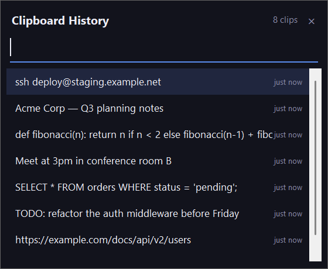

# Clipboard Manager

[](https://github.com/darkspaz-v1/clipboard-manager/actions/workflows/ci.yml)

A searchable history of everything you have copied, recallable without leaving the keyboard.



Windows keeps one clipboard slot, so copying anything destroys what was there before. This watches the
clipboard from the tray and keeps the last 500 text clips in a local SQLite database, so an overwrite
is no longer a loss.

## How it works

- Polls the clipboard from a background thread and writes new text to `history.db` (SQLite).
- History is **capped at 500 entries and deduplicated** — recopying the same text bumps the existing
  row to the top rather than inserting a duplicate.
- **`Ctrl+Alt+Shift+V`** opens a small popup listing recent clips. Type to filter, Enter or
  double-click to copy one back.

## Notes from building it

- The popup originally rebuilt every row on each hover and arrow-key move, which flickered visibly.
  Fixed by restyling only the row that changed.
- See [Known limitations](#known-limitations) below for the dedup quirk and the `history.db` privacy
  note.

**Stack:** Python, Tkinter, SQLite, `keyboard`, `pystray`, Pillow.

## Known limitations

- **Windows only.** Uses Win32 APIs (global hotkey, tray icon) with no Mac/Linux support planned.
- **`history.db` can contain sensitive pasted content.** Every text copy is written to this local
  SQLite file in plain text — passwords copied from a manager, tokens, personal messages, anything.
  It is gitignored and never leaves the machine on its own, but it is not encrypted, so back it up or
  sync it with the same care you would give a password file, and be aware it exists before pointing
  any cloud-backup tool at this folder.
- **Dedup is exact-text-match, not trimmed.** Recopying identical text bumps the existing row to the
  top, but the same text with a stray leading/trailing whitespace character is treated as a different
  entry and creates a new row instead of bumping the old one.

## Part of a suite

One of seven small Windows tray utilities built as separate, self-contained apps: each has its own
folder, its own virtualenv and its own `run.bat`, with no shared runtime. They are deliberately not a
framework — the only thing they share is a set of conventions.

| Convention | Why |
|---|---|
| Single-instance guard via a `.singleton.lock` file | An earlier `.instance.lock` design could get stuck after a force-kill and leave the app permanently unlaunchable |
| Relaunch brings the existing window forward | Previously a second launch silently did nothing, which was indistinguishable from the app being broken |
| Config lives in `config.json`, read at startup | Edit it, then fully exit the tray icon and relaunch — a running process never re-reads it |
| Tray icon generated in code (`icon.py`) | No binary asset to keep in sync |

## Quick start

```
python -m venv venv
venv\Scripts\python -m pip install -r requirements.txt
run.bat
```

`run.bat` launches the app from `venv\` with no console window. See [Known limitations](#known-limitations)
for platform requirements.

## Tests

```
venv\Scripts\python -m pip install -r requirements-dev.txt
venv\Scripts\python -m pytest
venv\Scripts\python -m ruff check .
```

The tests cover the pure logic (history cap, dedup, search) against a temporary SQLite file; they never
start the tray icon, popup or hotkey.

## Troubleshooting: log file location

Warnings and errors are written to `logs/clipboard-manager.log` in the app folder (rotating, gitignored).
A crash on startup also appends a traceback to `app_error.log` next to it.

## License

MIT — see [LICENSE](LICENSE).
